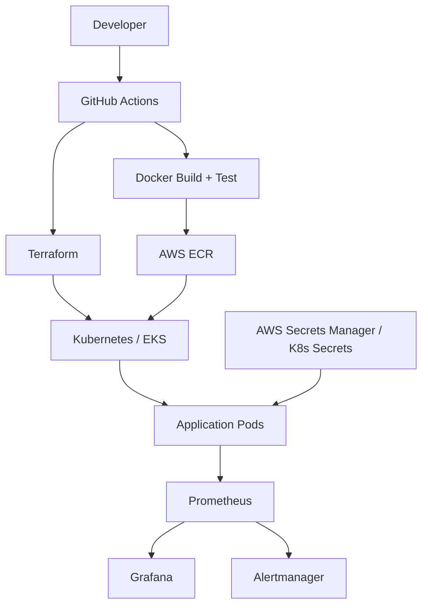

# ☁️ Cloud-Native DevOps / SRE Platform

[](https://github.com/AloneRider-pixel/cloud-native-platform/actions/workflows/ci.yml)
[](LICENSE)

**Cloud-native infrastructure reference platform for deploying, observing, and operating containerized applications on AWS.**

> **Portfolio focus:** AWS + Kubernetes + Terraform + CI/CD + observability + SRE practices.

## Architecture



## Engineering capabilities

### Infrastructure as Code
- Modular Terraform for VPC, EKS, RDS, ElastiCache, and S3.
- Environment separation for development, staging, and production configurations.
- Remote state design with S3 and locking support.

### Kubernetes
- EKS deployment patterns with Helm.
- Liveness/readiness probes and resource requests/limits.
- Horizontal Pod Autoscaling and PodDisruptionBudgets.
- Network policies and environment-specific overlays.

### CI/CD
- GitHub Actions build and deployment workflows.
- Multi-stage Docker images.
- AWS ECR image registry and scanning.
- Staged deployment and rollback strategy.
- GitOps-compatible Kubernetes manifests.

### Observability
- Prometheus metrics.
- Grafana dashboards.
- Alertmanager routing.
- Structured logs and correlation IDs.
- SLI/SLO and error-budget concepts.

### Security and operations
- Kubernetes RBAC and restricted security contexts.
- AWS Secrets Manager integration.
- Network isolation and TLS ingress.
- Runbooks, incident-response documentation, and rollback scripts.

## Technology stack

| Layer | Technology |
|---|---|
| Cloud | AWS: EKS, RDS, ElastiCache, S3, ECR |
| IaC | Terraform 1.6, Terragrunt |
| Containers | Docker |
| Orchestration | Kubernetes, Helm |
| CI/CD | GitHub Actions |
| Monitoring | Prometheus, Grafana, Alertmanager |
| Logging | Loki, Promtail |
| Ingress | Nginx Ingress Controller |
| Secrets | AWS Secrets Manager, Sealed Secrets |

## Repository structure

```text
cloud-native-platform/
├── infrastructure/terraform/
│   ├── modules/
│   └── environments/
├── kubernetes/
│   ├── base/
│   └── overlays/
├── helm/app/
├── docker/
├── monitoring/
├── scripts/
├── docs/
│   ├── architecture.md
│   ├── runbooks/
│   └── incident-response.md
└── .github/workflows/
```

## Local / AWS workflow

### Prerequisites

- AWS CLI
- `kubectl`
- Helm 3
- Terraform 1.6+
- An AWS environment suitable for the resources in the Terraform configuration

### Provision

```bash
cd infrastructure/terraform
terraform init
terraform plan -var-file="environments/dev.tfvars"
```

Apply only after reviewing the plan in your AWS account.

### Deploy

```bash
aws eks update-kubeconfig --name production-cluster --region ap-south-1
helm upgrade --install app ./helm/app \
  --namespace production \
  --create-namespace \
  --values helm/app/values-prod.yaml
```

### Observe

```bash
kubectl port-forward svc/grafana -n monitoring 3000:80
```

## SRE artifacts

The repository includes dashboard concepts and alert definitions for application error rate, latency, pod health, node pressure, disk usage, certificate expiry, and SLI/SLO tracking.

Treat alert thresholds as **reference configuration** and tune them to the workload, service objectives, and environment being deployed.

## Roadmap

- Policy-as-code with OPA/Gatekeeper.
- ExternalDNS and cert-manager automation.
- Progressive delivery with Argo Rollouts.
- OpenTelemetry traces and logs.
- Automated disaster-recovery drills.
- Cost visibility and resource-rightsizing dashboards.

## License

MIT
