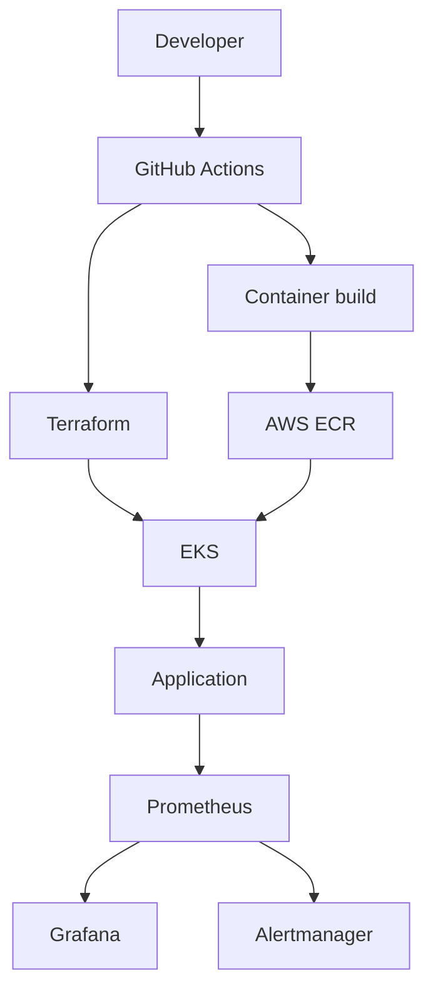

# Cloud-Native DevOps / SRE Platform

[](https://github.com/AloneRider-pixel/cloud-native-platform/actions/workflows/ci.yml)
[](https://github.com/AloneRider-pixel/cloud-native-platform/actions/workflows/codeql.yml)
[](LICENSE)

Cloud-native reference platform covering AWS infrastructure, Kubernetes workloads, Terraform, Helm, CI/CD, observability, and SRE operating controls.

## Architecture


```mermaid
graph TB
    DEV[Developer] --> CI[GitHub Actions]
    CI --> BUILD[Container build]
    BUILD --> ECR[AWS ECR]
    CI --> TF[Terraform]
    TF --> EKS[EKS]
    ECR --> EKS
    EKS --> APP[Application]
    APP --> PROM[Prometheus]
    PROM --> GRAF[Grafana]
    PROM --> ALERT[Alertmanager]
```

## Capabilities

- Modular Terraform for VPC, EKS, RDS, Redis, and monitoring.
- Kubernetes manifests with probes, resource limits, HPA, PDB, network policy, and RBAC.
- Helm packaging and deployment automation.
- Prometheus/Grafana/Alertmanager monitoring and runbooks.
- Production deployment through AWS OIDC rather than long-lived AWS keys.
- Rollout verification and rollback-oriented deployment paths.

## Stack

| Layer | Technology |
|---|---|
| Cloud | AWS EKS, RDS, ElastiCache, S3, ECR |
| IaC | Terraform |
| Orchestration | Kubernetes, Helm |
| Containers | Docker |
| CI/CD | GitHub Actions |
| Observability | Prometheus, Grafana, Alertmanager |
| Secrets | AWS Secrets Manager / Kubernetes Secrets |

## Repository map

```text
infrastructure/terraform/
helm/app/
kubernetes/base/
docker/
monitoring/
scripts/
docs/runbooks/
.github/workflows/
```

## Verification

```bash
cd infrastructure/terraform
terraform fmt -check -recursive
terraform init -backend=false
terraform validate

cd ../..
helm lint ./helm/app
python scripts/verify_kubernetes_posture.py
pytest tests/ -v
```

CI also builds the application image and runs CodeQL/Scorecard.

## Deployment safety

Production deployment is intentionally gated. Keep the explicit confirmation, OIDC authentication, immutable image reference, rollout health check, and rollback path intact.

Do not copy example account IDs, regions, cluster names, image names, or alert thresholds into production without environment-specific review.

## Security

Treat Terraform, IAM, Kubernetes policies, container images, ingress, and secret configuration as high-risk changes. Preserve least privilege, non-root workloads, network controls, and observable failure states.

## Evidence policy

Availability, latency, capacity, recovery, and cost claims require a named environment, workload, measurement window, tooling, and producing commit.

See [docs/evidence-policy.md](docs/evidence-policy.md).

## Documentation

- [Architecture](docs/architecture.md)
- [Verification](docs/verification.md)
- [Runbooks](docs/runbooks)
- [Engineering notes](docs/ENGINEERING_NOTES.md)

## Roadmap

Policy-as-code, progressive delivery, cert-manager/ExternalDNS automation, OpenTelemetry, disaster-recovery drills, and cost/rightsizing dashboards.

## License

MIT
