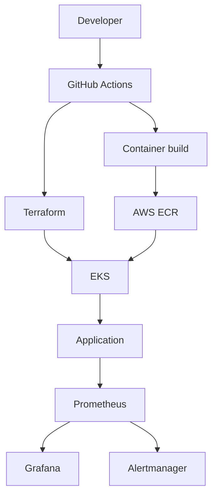

# Cloud-Native DevOps / SRE Platform

[](https://github.com/AloneRider-pixel/cloud-native-platform/actions/workflows/ci.yml)
[](https://github.com/AloneRider-pixel/cloud-native-platform/actions/workflows/codeql.yml)
[](LICENSE)

Cloud-native reference platform covering AWS infrastructure, Kubernetes workloads, Terraform, Helm, CI/CD, observability, and SRE operating controls.

## What it demonstrates

- Modular infrastructure for VPC, EKS, RDS, Redis, and monitoring.
- Kubernetes workloads with probes, resources, autoscaling, disruption budgets, network policy, and RBAC.
- Helm packaging and deployment automation.
- Prometheus, Grafana, Alertmanager, and runbook-oriented operations.
- AWS OIDC authentication instead of long-lived deployment keys.
- Rollout verification, rollback handling, and serialized production deployments.

## Architecture


```mermaid
graph TB
    DEV[Developer] --> CI[GitHub Actions]
    CI --> BUILD[Container build]
    BUILD --> ECR[AWS ECR]
    CI --> TF[Terraform]
    TF --> EKS[EKS]
    ECR --> EKS
    EKS --> APP[Application]
    APP --> PROM[Prometheus]
    PROM --> GRAF[Grafana]
    PROM --> ALERT[Alertmanager]
```

## Stack

| Layer | Technology |
|---|---|
| Cloud | AWS EKS, RDS, ElastiCache, S3, ECR |
| IaC | Terraform |
| Orchestration | Kubernetes, Helm |
| Containers | Docker |
| CI/CD | GitHub Actions |
| Observability | Prometheus, Grafana, Alertmanager |
| Secrets | AWS Secrets Manager / Kubernetes Secrets |

## Repository map

```text
infrastructure/terraform/
helm/app/
kubernetes/base/
docker/
monitoring/
scripts/
docs/runbooks/
.github/workflows/
```

## Verification

```bash
cd infrastructure/terraform
terraform fmt -check -recursive
terraform init -backend=false
terraform validate

cd ../..
helm lint ./helm/app
python scripts/verify_kubernetes_posture.py
pytest tests/ -v
```

CI also builds the application image and validates the Terraform, Helm, application, security, and repository quality surfaces.

## Deployment safety

Production deployment is intentionally gated. The deployment lifecycle validates inputs, authenticates to AWS through OIDC, deploys an immutable image reference, performs smoke verification, and retains a rollback path.

Deployments are serialized with a GitHub Actions concurrency group so two production deployment lifecycles cannot overlap.

Do not copy example account IDs, regions, cluster names, image names, or alert thresholds into production without environment-specific review.

## Security

Treat Terraform, IAM, Kubernetes policies, container images, ingress, and secret configuration as high-risk changes. Preserve least privilege, non-root workloads, network controls, and observable failure states.

## Evidence policy

Availability, latency, capacity, recovery, and cost claims require a named environment, workload, measurement window, tooling, and producing commit.

See [docs/evidence-policy.md](docs/evidence-policy.md).

## Documentation

- [Architecture](docs/architecture.md)
- [Verification](docs/verification.md)
- [Runbooks](docs/runbooks)
- [Engineering notes](docs/ENGINEERING_NOTES.md)

## Contribution standard

Prefer small infrastructure changes, validate locally before pushing, and keep deployment behavior documented alongside workflow changes.

## Roadmap

Policy-as-code, progressive delivery, cert-manager/ExternalDNS automation, OpenTelemetry, disaster-recovery drills, and cost/rightsizing dashboards.

## License

MIT
