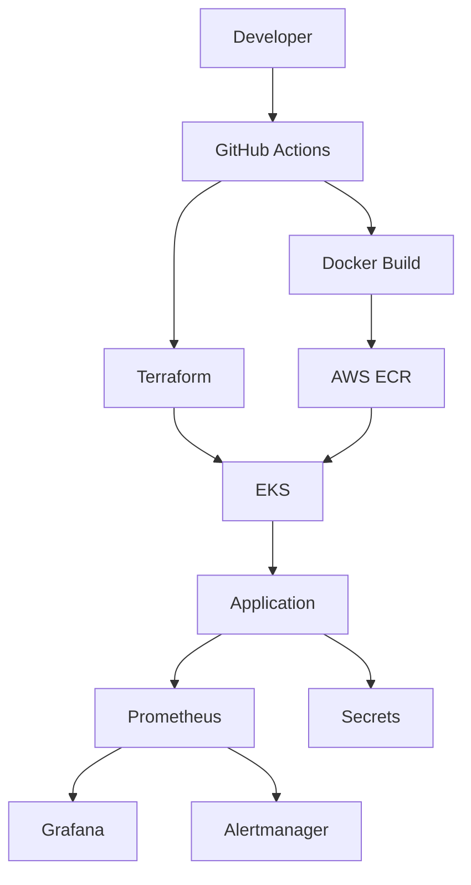

# ☁️ Cloud-Native DevOps / SRE Platform

[](https://github.com/AloneRider-pixel/cloud-native-platform/actions/workflows/ci.yml)
[](https://github.com/AloneRider-pixel/cloud-native-platform/actions/workflows/codeql.yml)
[](LICENSE)

Cloud-native infrastructure reference platform for AWS, Kubernetes, Terraform, CI/CD, observability, and SRE operations.

## Architecture


```mermaid
graph TB
    DEV[Developer] --> CI[GitHub Actions]
    CI --> BUILD[Docker Build]
    BUILD --> ECR[AWS ECR]
    CI --> TF[Terraform]
    TF --> EKS[EKS]
    ECR --> EKS
    EKS --> APP[Application]
    APP --> PROM[Prometheus]
    PROM --> GRAF[Grafana]
    PROM --> ALERT[Alertmanager]
    APP --> SEC[Secrets]
```

## Capabilities

- Modular Terraform for VPC, EKS, RDS, Redis, and related infrastructure.
- Kubernetes deployment patterns with health probes, resource limits, HPA, PDB, network policy, and RBAC.
- Helm packaging and GitHub Actions CI/CD.
- Prometheus/Grafana/Alertmanager monitoring and operational runbooks.
- Production deployment workflow using AWS OIDC with a narrowly scoped `id-token: write` permission.

## Stack

| Layer | Technology |
|---|---|
| Cloud | AWS EKS, RDS, ElastiCache, S3, ECR |
| IaC | Terraform, Terragrunt |
| Orchestration | Kubernetes, Helm |
| Containers | Docker |
| CI/CD | GitHub Actions |
| Observability | Prometheus, Grafana, Alertmanager |
| Secrets | AWS Secrets Manager / Kubernetes Secrets |

## Repository layout

```text
infrastructure/terraform/
  modules/
  environments/
helm/app/
kubernetes/base/
docker/
monitoring/
scripts/
docs/runbooks/
.github/workflows/
```

## Verification

Terraform and application checks:

```bash
cd infrastructure/terraform
terraform fmt -check -recursive
terraform init -backend=false
terraform validate

cd ../..
helm lint ./helm/app
python scripts/verify_kubernetes_posture.py
pytest tests/ -v
```

CI also builds the application image and runs CodeQL/Scorecard.

## Deployment

Production deployment is intentionally manual. The workflow requires an explicit deployment confirmation and an immutable image tag, authenticates to AWS using OIDC, waits for rollout completion, performs a health check, and contains an automatic rollback path on failure.

Do not treat the example AWS account, cluster name, region, image, or alert thresholds as production defaults; configure them for the target environment.

## Security

Treat Terraform, IAM, Kubernetes manifests, container images, ingress, and secrets as high-risk configuration. Keep least privilege, network controls, non-root workloads, health probes, and rollback paths intact.

## Evidence and reproducibility

This is reference infrastructure. Any published availability, latency, capacity, recovery, or cost result should identify the environment, workload, measurement window, tooling, and producing commit.

## Roadmap

- Policy-as-code.
- cert-manager / ExternalDNS automation.
- Progressive delivery.
- OpenTelemetry.
- Disaster-recovery drills.
- Cost and rightsizing dashboards.

## Review path

Start with [architecture](docs/architecture.md), [verification](docs/verification.md), and [runbooks](docs/runbooks). Review infrastructure changes with the Kubernetes posture script before deployment.

## Maintenance standard

Keep infrastructure declarative, secrets externalized, CI permissions minimal, and rollback procedures executable.

## License

MIT
